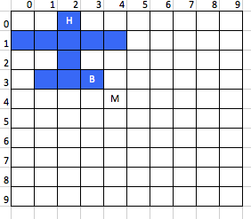
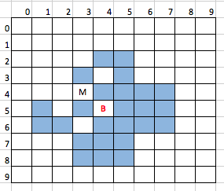
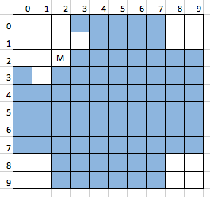

# Capstone Project - Plane shooting

## Machine Learning Engineer Nanodegree

Uuganbayar Sukhbaatar  
August 29th, 2016

## I. Definition

### Project Overview

This is a pencil and paper game similar to the [Battleship game](https://en.wikipedia.org/wiki/Battleship_game). We used to play this game during school days.

The game is played by 2 players on four grids, two for each player. The grids are 10×10 square – and the individual squares in the grid are identified by row and column number. On one grid the player arranges ships and records the shots by the opponent. On the other grid the player records their own shots.

Before play begins, each player secretly arranges their planes on their primary grid, usually 2-3 planes. Each plane occupies a number of consecutive squares on the grid, arranged either horizontally or vertically.

One player tells the coordinates for shot, and the other give a feedback whether the player has hit or missed the plane. The best shooter who shot all planes of the opponent will win the game.


### Problem Statement

Human player secretly arranges a plane with the following figure on a grid with size of 10x10, let's say it an environment. You have to develop an agent that is capable to learn how to shoot the plane in this environment.

  

The human player gives a feedback with letter `H` for head shot, `B` for body shot and `M` for miss (see the figure above).

Using this feedback the agent have to find the head of the plane with minimum possible shots. The agent must learn optimal technique using Machine Learning, and be able to compete with a human player. The Reinforcement Learning is recommended one, but any Machine Learning technique or combination of them are accepted.

### Metrics

The agent's goal is to find the plane head with minimum possible shots.  So how many shots are required to destroy any plane? I couldn't tell exact number, but I have some reasonable metrics.

To measure the performance of the agent, I have chosen the average number of shots until the head is found. This will be a main factor to indicate the performance.

The average number of shots will be calculated as the following.

```
  Average shot per play = totals shots / the number of play
```

## II. Analysis

### Data Exploration

There is no existing dataset for this problem. But there is some input, one is a hint.

In order to minimize shots, a hint of next possible head locations is given to the agent. The agent must learn from this hint, and learn to select the best guess for head shot.


As I know, there are some well known tactics for the best guess. I didn't explore all best tactics, the agent might found all best tactics. The below is shown two of them.


** Sample 1: A body shot **

For example, if got a body shot ('B') on location (4,5), then after this shot the hint will look like the following. There are 32 possible head location after the body shot at (4,5).

  

Furthermore from this visualization of head distribution, we could see that intersected squares (with tick borders) are the most efficient shots. Specially the square (3,4), (5,4), (3,6) and (5,6) are the most efficient locations to try. By shooting at these squares the agent will be rewarded anyway as one of the following:

* Could win the game by just hitting a head, because these four locations are possible head locations.

* Could be a body shot, for example at (3,4). If so the next possible head locations will be 3 times less at least.

  

* Could be a miss. Even in this case the agent will get benefit, because the next possible head locations will be reduced by 6.

  

** Sample 2: A missed shot **

If the agent missed at (2,2), then it still has to learn something from this shot, because this shot will reduce the next possible heads. In the below figure, white squares are non-head coordinates after this missed shot, so the agent will skip these squares for the next shot.



Then agent have to choose the median points from the hint for the next shot, but the closest one from the last shot.


### Algorithms and Techniques

This problem could be solved by using the Reinforcement Learning (RL) approach. The ultimate goal is to make an agent that able to play against real human.

The idea is to reward every efficient shot. How efficient is measured on every shot by the reduction of unknown area. A big reduction will be rewarded more, a little reduction will be rewarded less. So it will lead to the minimal shots and optimal tactics.

Also could be some punishment, for example we could punish the agent if it shot at same location repeatedly.

The agent could use all random guess tactic. But it will not succeed, even it may be worse than the simple plain 100 shots. So the agent has to learn some best practices under some policy.

So the best tactic is to explore the grid and shrink the blue area as much as possible while seeking the plane head.

With this idea and enough number of training, I think the agent could 'learn' how to shoot efficiently.

** Parameters for RL **

Here is the main parameters for RL:

* *States*: If we count every square values on the grid, there could be 3^100 states for this game. 3 is the number of shot marks per square, these are 'B', 'M' and empty, 100 is the number of squares. This is a huge number and takes tremendous amount of time to train the agent. Anyway we will use a grid with the shot marks as a state, because it represents the current state the best.

* *Actions*: There are 100 actions, each action represents every square of the grid. Luckily we will use hints to limit the number of actions. So it will be fewer and fewer 'state-action' combinations after each shot.

* *Reward*: Finding a optimal reward policy is the one important part of this solution. Reward policy which I found the most optimal is: If the agent hit the head of plane, then it will be rewarded by 100 points. In other cases, the reward will be equal to the reduction size of the blue area (head hints). It won't exceed than 100, that is why the maximum reward is 100.

 General reward formula is:

  ```
  reward = len(hint_old) - len(hint_new)
  ```

  For example, in case of the `Sample 1` of the section 'Data Exploration', by shooting at `(3,4)`, the agent will be rewarded by score 22, because before the shot the length of hint was 32, after the shot it become 10, so 32 - 10 = 22. So the shot was efficient that much in that particular state.

* *Punishment*: The agent should avoid repeated shots at same location. It's extremely useless and stupid action, so we could punish the agent by -1000 (almost never do it again). Also we could punish the agent if it shot at different location than a suggested hint.

* *Alpha*: alpha 0.1 is suggested value for a stochastic problem

* *Gamma*: It could be 2.0. So the agent will focus on current rewards. I think a current reward policy is efficient enough to lead the agent into correct way.

* *Epsilon*: Since this is a stochastic type of problem, I set the epsilon to 0.5. So the agent is allowed to make random shots with 50% probability. In other 50%, it must use it's past experience.


### Benchmark

In worst case the agent could find the head with 100 shots, which means it has to hit every square on the grid. But our agent has to be smarter than this.

It's possible to find some part of the plane with 10 shots at maximum. Because the plane occupies 1/10 size of space on the board. Only thing is to keep correct amount of gap between shots to cover all area.

Once the agent hit on the body of the plane it should be easy to guess the head. Usually 2-4 shots needed to find the head after body shot. So in total, 14 shots should be enough to destroy any plane.

From my experience, it is possible to find the head of plane with 9 shots on average. So this could be a guideline value for benchmark. Some lucky human players could find the head with 5-6 shots.

There are 168 plane layouts in total. So we will benchmark the agent for all these possible layouts.

Also you could design a certain scenario like as the chess game and could check the actions of the agent in this scenario.


## III. Methodology

### Data Preprocessing

There is no data pre-processing is required for this problem.

But after the problem is solved we could use the trained dataset for a real game (against real human).

### Implementation

The implementation consists from 3 code sections: environment, agent and simulation modules.


** The environment module **

 The environment implementation was the most important part of the problem. It contains the grid and plane. This is also a controller module, that controls the game using the reward and punishment approach.

 The most important methods are:

* `new_game()` - it prepares for a new game, initialize the grid, cleans data, layout the plane  etc.

* `shoot()` - it applies a shot in the environment and calculates the reward for that shot. The following code section calculates the reward.

  ```python
  hint_old = len(self.hints)

  if shot_resp == 'H': # head shot
      reward = 100.0
      self.board[shot[1]][shot[0]] = shot_resp
  else:
      #  punish by -10000.0 for repeated shot
      if self.board[shot[1]][shot[0]] != ' ':
          reward = -1000.0
      else:
          self._update_hints(shot, shot_resp)
          # reward amount
          reward = hint_old - len(self.hints)

  ```

* get_hints() - gives a hint of possible head locations, hint will be updated after every shot

There are other utility methods.

* `random_plane()` - creates a random positioned plane.

* `valid()` - checks if a given head and position is valid

* `show()` - displays the environment on the screen


** The agent module **

This is a student, our agent, that learns how to shoot. This agent is capable to shoot and can learn based on the feedback.

* `next_shoot()` - gives a shot

* `learn()` - learns from the feedback

* `build_state()` - forms a current state

The `next_shoot` method gives the next shot from the agent and it will be applied in the environment.

```python
    def next_shoot(self):
      self.state = self.build_state()

      shot = 0

      # branch according to the exploration factor
      if random.random() < self.epsilon:
          shot = random.choice(self.actions)
      else:
          sa_Q_values = [self.q.get((self.state, a), 0.0) for a in self.actions]
          sa_max = max(sa_Q_values)

          # select an action with maximum Q value
          sa_max_indexes = [i for i in range(len(self.actions))
                if sa_Q_values[i] == sa_max]
          i = random.choice(sa_max_indexes)
          shot = self.actions[i]

      # (x, y) хэлбэрт оруулах
      y = shot / self.env.size
      x = shot % self.env.size

      return (x, y)
```

After every shot the agent learns using `learn()` method.

```python
  def learn(self, state1, action1, reward1, state2):
      if state1 == None or len(self.actions) == 0:
          # no previuos state
          return

      sa1 = self.q.get((state1, action1), 0.0)
      sa2_maxQ = max([self.q.get((state2, a), 0.0) for a in self.actions])

      # Q learning formula: Q(s,a) <- Q(s,a)+alpha[r+ gamma* max Q(s',a')-Q(s,a)]
      self.q[(state1, action1)] = sa1 + self.alpha * (reward1 + self.gamma*sa2_maxQ - sa1)
```

** The simulator **

This module simulates a human player and playes with the agent. It is designed to train the agent and check its performance according to the metrics.

There are 168 variants of the plane. The simulator plays all these variants with the agent, and it does 500 trails for one layout. So it will be 168*500 trials in total.

### Refinement

I did several experiments on the parameters of Reinforcement Learning.  

I tried other reward policy for the agent. That policy was like: "100 points for head shot, 10 points for body shot, -1 points for missed shot". But this policy didn't perform well. Finally have chosen the policy mentioned in the section "Algorithms and Techniques".

Gamma was set to 2.0. So the agent is more focused on current rewards.

Also I did some test on the epsilon parameter. The agent was performing poorly when epsilon is higher than 0.7, which means mostly random actions were chosen. 0.5 was the best optimal value for the epsilon parameter, also it's good for exploration.


```
TODO:
Good work with the refinements, however, to meet specification in this section, a table with the results *before and after" the refinement is needed. If the results after your "refinements" are worse than the initial results, there is no problem with that, but an explanation is needed to analyze the result.
```

## IV. Results


The agent is tested against 168*500 trails. The average shot until head is found was 8.9, this is acceptable result, I think.


Here is the result:

|epsilon|average shot|
|-|-|
|0.8|9.01|
|0.5|8.89|


## V. Conclusion

### Free form visualization

The shot distribution for particular layout was interesting to me. So I wanted to create some visualization using shot distribution after every simulation.

The following picture shows how the agent sees the plane layout after 100 trails.

**Sample 1:**

A plane that South headed at (7, 7):


From this visualization we could see the colors, which represents a density of shots at that particular square. The dark blue parts are head and body squares, and lighter area is less or non-related squares to the plane.

It may be a blurred vision, but somehow it shows the agent's rough "understanding" about that particular layout.

In the picture above you could see that the plane is headed to the South and located at square (7,7).

**Sample 2:**

A plane that East headed at (8, 7):


 It's a plane with East head and located at square (8, 7).

### Reflection

This is a simple guessing game, but it has some degree of complexity similar to other board games like Chess and Go.

I wanted to solve this problem using Machine Learning, because I had some thoughts: "could the agent find all best tactics ?", "could the agent play against an experienced human ?".


The perfect agent is one who learnt all state-action combinations, which is 3^100 (approx. 5.1537752e+47) states and 100 actions. It's a huge value, 5.1537752e+49. To memorize this amount of state-actions I need a lot computing power.

Instead I choose to use the hint approach. In addition to that, the agent must learn to select the best action within the hint. This was the most important point of the problem.


### Improvement

Still there is a room for improvement.

One problem is it takes long time to learn all possible state-actions. It takes 20 minutes to train all layouts, in case of 500 trails per layout. It means we have to wait for 20 minutes if we want to check the agent on real game. Beside that it learns  only some part of all state-actions. I hope those are the most important combinations, but not sure. To check this we have to make test scenarios and check the agent for that scenario (like chess scenario).

Anyway, we could reduce the training time. One idea is we could divide the game into two phases: one is before a body shot, another phase is after a body shot. The reason is to reduce the number of states. We will have fewer states instead of 3^100 states.

And then, in the first phase, we may not use the Reinforcement Learning, instead we could use some statistics or classification algorithms from the Machine Learning. For the second phase we will use Reinforcement Learning as solved before.

Also we could reduce possible actions, specially in the phase two.

Another idea is we could use pre-learned dataset on every run. Then the agent will learn cumulatively.
